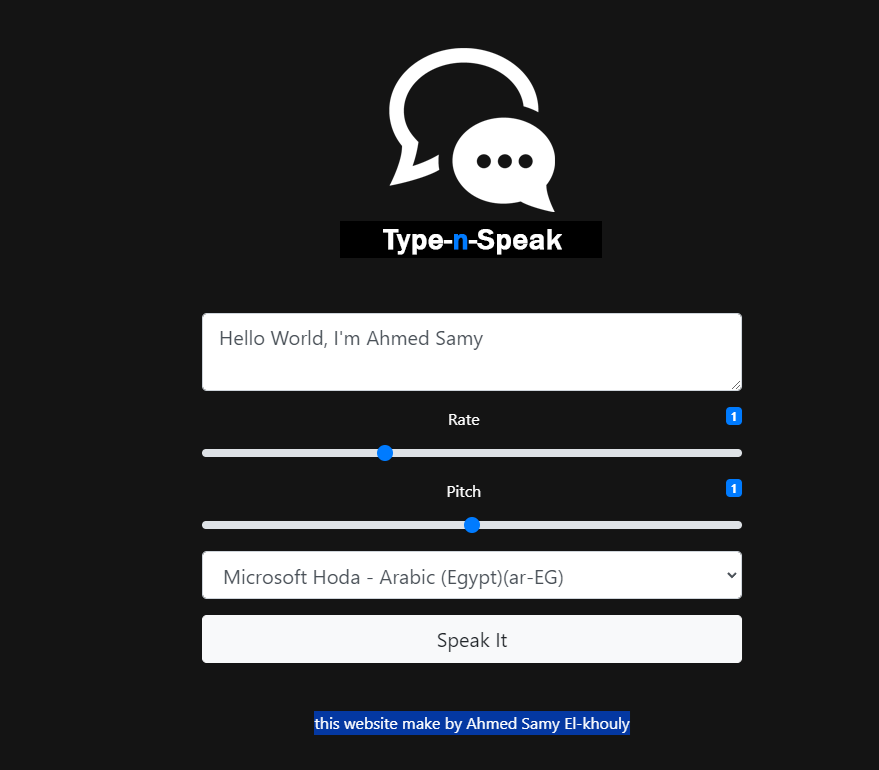

# speek-it

## Text-to-Speech App

This web application uses the SpeechSynth API to fetch all available text-to-speech (TTS) voices through the web browser and the local device.

You can read text from a single line to a complete article—it's up to you! Just add text, adjust the settings (voice, rate, and pitch), press the "Speak It" button, and the app will speak the text using the selected voice.

the app is Compatible with multiple browsers and devices you can use it on PC, Mac, Linux, Android, IOS...

Try the demo [here](https://speekit.netlify.app/).

### Contributions

We welcome contributions to this project! If you find a bug, have an idea for an improvement, or want to contribute in any other way, please feel free to open an issue or submit a pull request.

## License

This project is licensed under the [GNU General Public License, version 2](https://tldrlegal.com/license/gpl-v2). See the [LICENSE.md](LICENSE.md) file for details.
